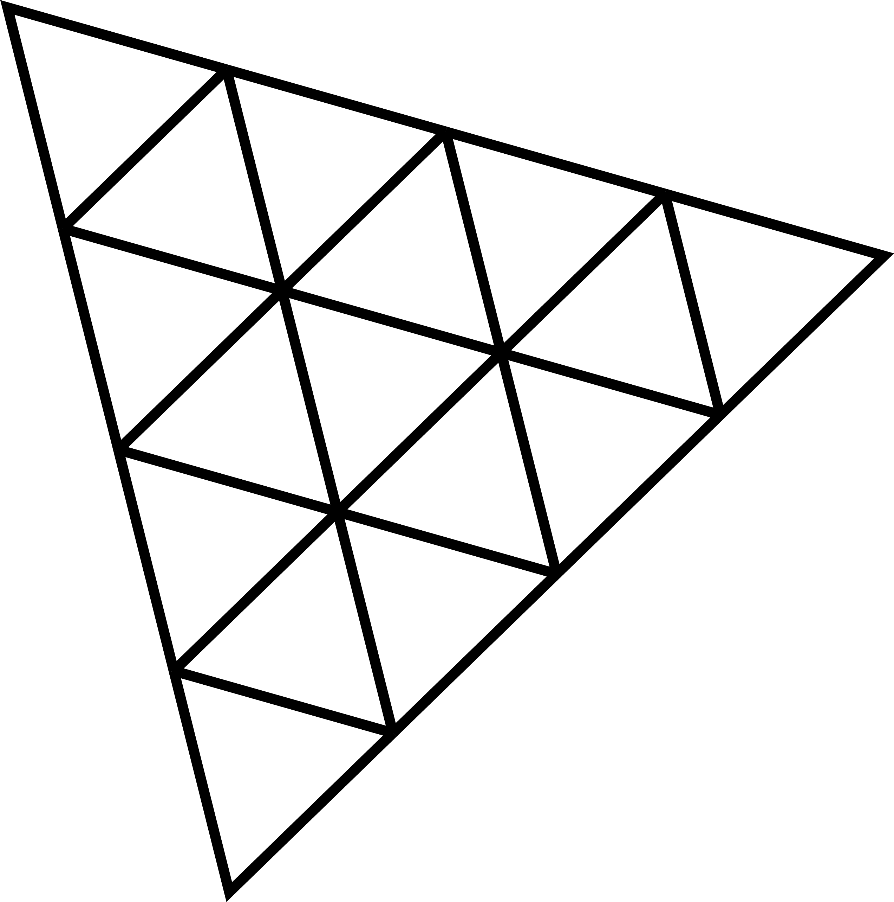
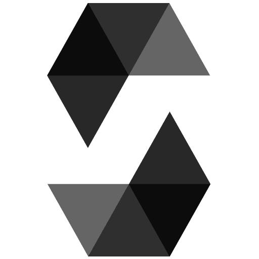

<h1>METABLOX</h1>

 

  
  
  
  
  
  
  
  
  

  
- This project is a web3 sandbox proof of concept, that allows users to purchase digital worlds in the form of NFTs, build upon them using 3D rendered blocks, and share those worlds inside of a metaverse that is saved to the blockchain. 
- The block-building gameplay aspect of this project was adapted from [this tutorial](https://www.youtube.com/watch?v=qpOZup_3P_A) by [Daniel Bark.](https://www.youtube.com/channel/UCgUCptbp4T5saC5WXePe1sw) 
- The proof of concept utilizes an in-game cryptocurrency, called MBlox, which faciliates the purchasing of different digital blocks for users to build with and the worlds in which they build.
- The project is also playable without any web3 knowledge or integration; there is a "Sandbox" mode available from the Main Menu which allows a user to build within a provided digital world with an infinite number of blocks without the need of any web3 wallet connection of crypto balance of any kind.
- [Play Here](https://meta-blox-v1.vercel.app/)

## Gameplay Overview
There are four main aspects of gameplay within the project. These are as follows:

### Exchange
- This aspect of gameplay allows users to convert their Polygon Mumbai Matic into the in-game currency (MBlox) to use within the game.
- Alternatively, if the user has previously played by [METAGRANGERS game](https://github.com/BGHProjects/MetaRanger_v1) and has earned the in-game METR token of that game with the wallet they have connected to this project, they will be able to claim a lump sum of MBlox equal to the difference their last claim and their current claim, (e.g. if they are claiming for the first time, the user can claim their entire METR balance as MBlox, and if they play METARANGERS since then and claim more METR since then, they can claim the new METR they have earned as MBlox)

### Marketplace
- This area of the project is where players can exchange their MBlox for the MetaBlox token, which represents the different blocks that can be used to build within the worlds of the game
- The different variations of blocks that are available to the user are Dirt, Grass, Glass, Wood, Log, Lava, Gold, Opal, Amethyst, and Space.

### Sandbox
- As described earlier, this aspect of game allows the player to enter a digital world (equivalent to one of the worlds of the game) and build whatever they desire within it with an unlimited number of blocks at their disposal.
- Players are unable to save anything that they create within the Sandbox to the blockchain, as this mode is intended to be an avenue of gameplay available to Web2 users.

### MetaGrid
- This aspect of gameplay allows user to either purchase new worlds to build in, build in said purchased worlds, visit other user's individual worlds, or visit the MetaGrid itself, which is a vast digital world in which all one hundred available worlds within the project and rendered and laid out before the user, which they can explore in its entirety.
- The different worlds are laid out in a grid of tiles, with coloured tiles represent worlds that are already purchased by users, and black tiles representing unclaimed worlds available for purchase.

## Test Coverage

