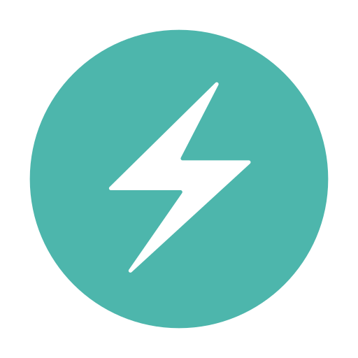

  <video src="./readme_content/ingame/menu_recording.mp4" alt="Menu Recording" loop />

 

  
  
  
  
  
  
  
  
  

  

  

  

- This project is a web3 sandbox proof of concept, that allows users to purchase digital worlds in the form of NFTs, build upon them using 3D rendered blocks, and share those worlds inside of a metaverse that is saved to the blockchain.
- The block-building gameplay aspect of this project was adapted from [this tutorial](https://www.youtube.com/watch?v=qpOZup_3P_A) by [Daniel Bark.](https://www.youtube.com/channel/UCgUCptbp4T5saC5WXePe1sw)
- The proof of concept utilizes an in-game cryptocurrency, called MBlox, which faciliates the purchasing of different digital blocks for users to build with and the worlds in which they build.
- The project is also playable without any web3 knowledge or integration; there is a "Sandbox" mode available from the Main Menu which allows a user to build within a provided digital world with an infinite number of blocks without the need of any web3 wallet connection or crypto balance of any kind.
- This project was also deployed using Vercel (referenced in the stack above), and is available to play at the following address: [https://meta-blox-v1.vercel.app](https://meta-blox-v1.vercel.app)
- NOTE: This project is a proof of concept, and not intended to represent a polished Web3 application. The contract system used in this application has not been audited, and I take no responsiblity for any issues that may arise out of its extended use.

## Gameplay Overview

There are four main aspects of gameplay within the project. These are as follows:

### Exchange

- This aspect of gameplay allows users to convert their Polygon Mumbai Matic into the in-game currency (MBlox) to use within the game.
- Alternatively, if the user has previously played by [METAGRANGERS game](https://github.com/BGHProjects/MetaRanger_v1) and has earned the in-game METR token of that game with the wallet they have connected to this project, they will be able to claim a lump sum of MBlox equal to the difference their last claim and their current claim, (e.g. if they are claiming for the first time, the user can claim their entire METR balance as MBlox, and if they play METARANGERS since then and claim more METR since then, they can claim the new METR they have earned as MBlox)

### Marketplace

- This area of the project is where players can exchange their MBlox for the MetaBlox token, which represents the different blocks that can be used to build within the worlds of the game
- The different variations of blocks that are available to the user are Dirt, Grass, Glass, Wood, Log, Lava, Gold, Opal, Amethyst, and Space.

### Sandbox

- As described earlier, this aspect of game allows the player to enter a digital world (equivalent to one of the worlds of the game) and build whatever they desire within it with an unlimited number of blocks at their disposal.
- Players are unable to save anything that they create within the Sandbox to the blockchain, as this mode is intended to be an avenue of gameplay available to Web2 users.

### MetaGrid

- This aspect of gameplay allows user to either purchase new worlds to build in, build in said purchased worlds, visit other user's individual worlds, or visit the MetaGrid itself, which is a vast digital world in which all one hundred available worlds within the project and rendered and laid out before the user, which they can explore in its entirety.
- The different worlds are laid out in a grid of tiles, with coloured tiles represent worlds that are already purchased by users, and black tiles representing unclaimed worlds available for purchase.

## Screenshots

### Main Menu

### Sandbox Gameplay

### MetaGrid Gameplay

## Contract System

This proof of concept uses a smart contract system that includes four implementations and seven interfaces. All the contracts were deployed to the [Polygon Mumbai Test Network](https://mumbai.polygonscan.com/), were written in the Solidity programming language and deployed using Hardhat, both of which are referenced in the stack displayed above. The implementations used in this smart contract system are as follows:

### [MBlox](https://mumbai.polygonscan.com/address/0x8CC4b7E3d689Fb5b12D53492c523707095fD3C13#code)

- This contract represents the in-game currency that is primarily used to purchase the other tokens in the game.
- It is a relatively basic [upgradeable ERC20 contract](https://github.com/OpenZeppelin/openzeppelin-contracts-upgradeable/blob/v4.7.3/contracts/token/ERC20/ERC20Upgradeable.sol) that provides basic minting and burning functionality.

### [MetaBlox](https://mumbai.polygonscan.com/address/0x02cCF93F1Ba99146107328CA64cb641C63615309#code)

- This contract represents the different blocks that the user is able to purchase and then use to build with within the game.
- It is an implementation of an [upgradeable ERC1155 contract](https://github.com/OpenZeppelin/openzeppelin-contracts-upgradeable/blob/master/contracts/token/ERC1155/ERC1155Upgradeable.sol), that contains balances for each of the variants of blocks as described above, the prices of each block in MBlox, and minting, burning, and batch minting and burning functionality.

### [World](https://mumbai.polygonscan.com/address/0x8504058723cc400edb1ab3e60035ef153334f482#code)

- This contract represents the different worlds that users can purchase and build within the game.
- It is an implementation of an [upgradable ERC721 contract](https://github.com/OpenZeppelin/openzeppelin-contracts-upgradeable/blob/master/contracts/token/ERC721/ERC721Upgradeable.sol), that includes URI storage and burning functionality.

### [GameManager](https://mumbai.polygonscan.com/address/0x82869119dDa5ADE65f010541f16fAD3fab362a81#code)

- This contract facilitates interactions between the game and smart contract system.
- It is a [custom upgradeable contract](https://github.com/OpenZeppelin/openzeppelin-contracts-upgradeable) and includes several key aspects of functionality, including getter functions for retrieving values relevant to the game, enabling users to purchase other tokens within the MBlox in-game currency, and handling changes to world tokens that users make by placing and removing blocks.
- The Game Manager also restricts the minting and burning capability of the other contracts in the system to actions that occur in the game, to prevent malicious users from attempting to mint or burn tokens outside of the context of the game. This is primarily facilitated through the use of a "digitalKey" variable that is required to call any functions that pertain to major functionality.

## Test Coverage

